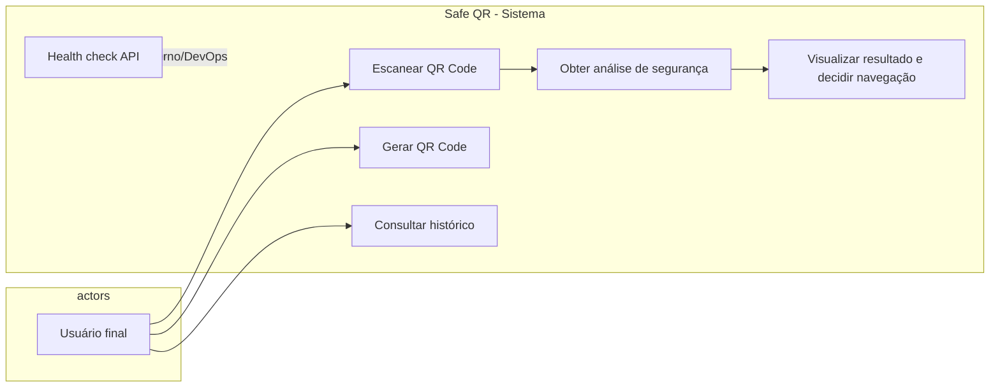
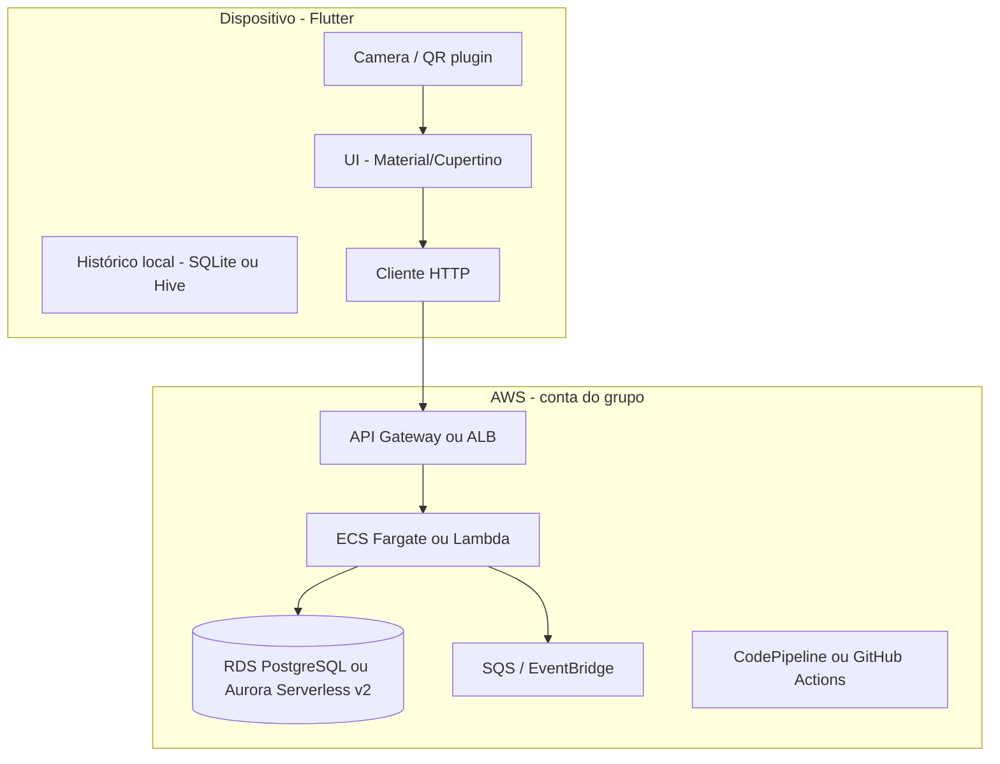
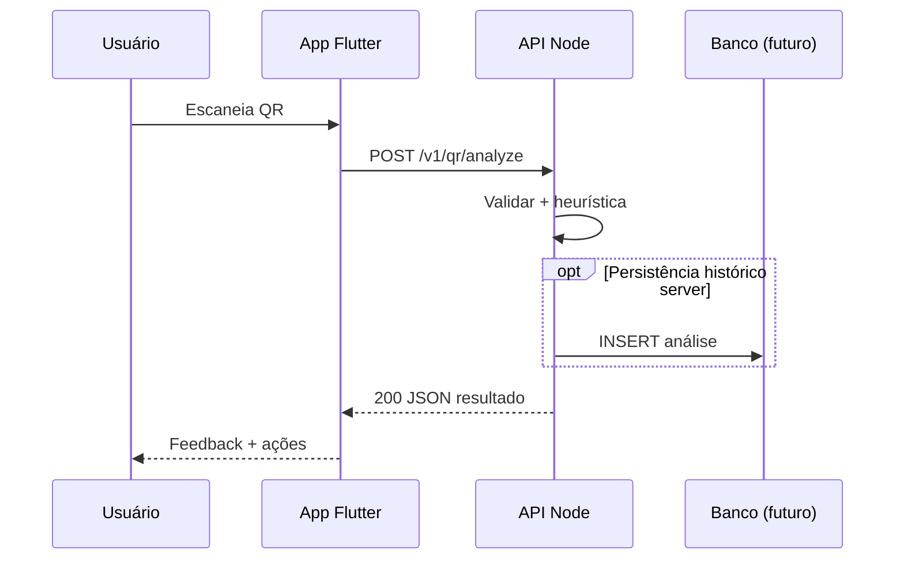
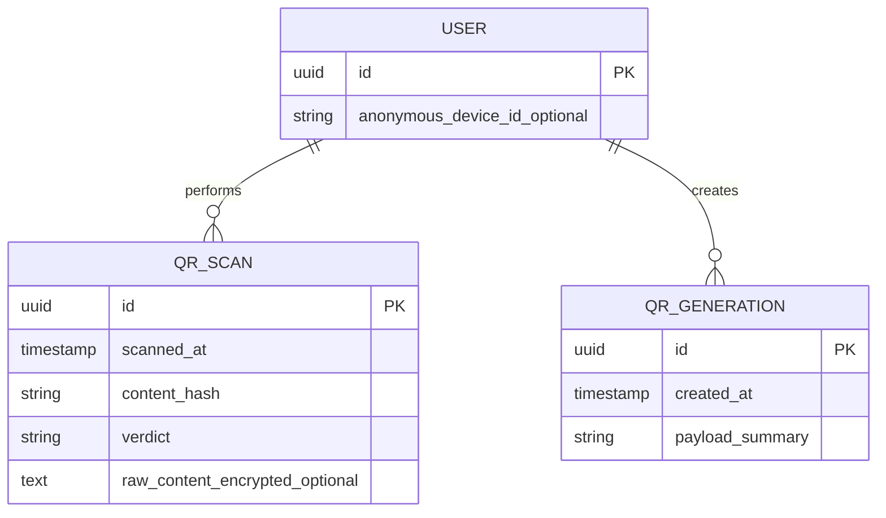
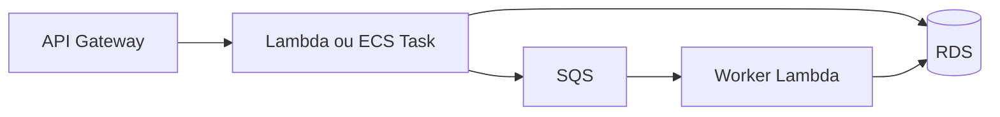

# Safe QR — Sprint 1: Estruturação inicial do projeto

**Versão:** 1.0  
**Data:** 27 de março de 2026  
**Papel:** documento de arquitetura e entregáveis acadêmicos (Computação em Nuvem II, modelagem, requisitos).

---

## 1. Visão do produto e escopo

### 1.1 Problema

Usuários finais estão expostos a **QR Codes públicos** (cardápios, pagamentos, Wi‑Fi, campanhas) que podem encaminhar para **phishing**, **sites clonados**, **deep links maliciosos** ou **esquemas de pagamento fraudulentos**. O celular costuma abrir o destino **sem camada intermediária** de análise ou explicação de risco.

### 1.2 Proposta de valor

Aplicativo **Flutter** que:

1. **Lê** o conteúdo do QR Code no dispositivo.
2. **Envia** (ou deriva metadados) para um **backend** que **classifica** o destino e **explica** riscos de forma compreensível.
3. **Oferece** feedback claro (seguro / suspeito / inseguro) e **opção de navegação** consciente (ex.: abrir no navegador, copiar, cancelar).
4. Complementa com **gerador** de QR Codes e **histórico** local ou sincronizado (evolução por sprint).

### 1.3 Escopo da Sprint 1 (o que entra agora)

| Área | Dentro do escopo S1 |
|------|---------------------|
| Documentação | Escopo, RF/RNF, modelagem inicial, nuvem justificada |
| Repositório | Organização GitHub do grupo, README, branches base |
| Backend | Projeto Node.js inicial, API REST mínima configurada (health + stub de análise) |
| Mobile | Protótipo Flutter com **telas estáticas** e navegação do fluxo descrito |
| Dados | Modelo **conceitual** e **lógico** (sem obrigatoriedade de migrações completas na S1) |

### 1.4 Fora do escopo da Sprint 1 (explícito)

- Motor de análise completo (listas negras globais, ML, sandbox de URLs).
- Autenticação de usuário robusta (OAuth, biometria como requisito).
- Loja publicada (Play/App Store).
- Conformidade formal (LGPD implementada ponta a ponta) — apenas **princípios** nos RNF nesta sprint.

### 1.5 Premissas e decisões de arquitetura (S1)

- **Stack mobile:** Flutter 3.41.x, Dart 3.11.x.  
- **Stack backend:** Node.js (LTS recomendado), framework **Express** ou **Fastify** (ambos adequados; Fastify tende a melhor throughput com schema validation; Express maximiza exemplos e curva de aprendizado). **Sugestão:** Fastify + `@fastify/cors` + `zod` para contratos.  
- **Comunicação:** HTTPS, JSON REST; versionamento de API (`/v1/...`).  
- **Análise na S1:** pode ser **heurística + stub** (resposta fixa ou regras simples), desde que o **contrato** da API esteja estável para o app.

---

## 2. Requisitos funcionais (RF)

### 2.1 RF — Aplicativo mobile

| ID | Descrição | Prioridade |
|----|-----------|------------|
| RF-M01 | Exibir **splash** ao iniciar o app. | Must |
| RF-M02 | Acessar **leitor de QR Code** a partir do fluxo principal (pós-splash ou via aba). | Must |
| RF-M03 | Capturar/decodificar payload do QR (texto/URL) usando câmera ou entrada simulada em dev. | Must |
| RF-M04 | Enviar o conteúdo (ou hash + metadados, conforme política de privacidade) ao backend para **análise**. | Must |
| RF-M05 | Exibir **resultado**: classificação (ex.: seguro / suspeito / inseguro) e **motivos** em linguagem acessível. | Must |
| RF-M06 | Oferecer ações pós-análise: **abrir URL** (se aplicável), **copiar**, **voltar ao leitor**, **cancelar**. | Should |
| RF-M07 | **Menu principal** com 3 abas: (1) Leitor, (2) Gerador, (3) Histórico. | Must |
| RF-M08 | **Gerador**: permitir informar texto/URL e gerar QR (visual estático na S1 aceitável). | Should |
| RF-M09 | **Histórico**: listar leituras e QR gerados (persistência local na S1; sync opcional em sprints futuras). | Should |
| RF-M10 | Tratar erros de rede e timeout com mensagem amigável. | Should |

### 2.2 RF — Backend (API)

| ID | Descrição | Prioridade |
|----|-----------|------------|
| RF-B01 | Expor endpoint de **health** (`GET /health` ou `/v1/health`) para observabilidade e CI. | Must |
| RF-B02 | Expor `POST /v1/qr/analyze` recebendo payload com o **conteúdo bruto** do QR (e opcionalmente metadados: plataforma, versão do app). | Must |
| RF-B03 | Responder com **status de segurança**, **lista de razões** e **metadados** (ex.: domínio extraído, esquema detectado). | Must |
| RF-B04 | Validar entrada (tamanho máximo, tipos) e retornar erros padronizados (`4xx`/`5xx` + corpo JSON). | Must |
| RF-B05 | Registrar **log estruturado** da requisição (sem armazenar PII desnecessária na S1). | Should |
| RF-B06 | (Futuro próximo) Persistir histórico server-side se o produto exigir conta de usuário. | Could |

### 2.3 Regras de negócio iniciais (heurísticas evolutivas)

Exemplos de sinais que o motor pode usar ao longo do projeto (não todos na S1):

- Esquema não HTTP(S) (`javascript:`, `data:`, apps específicos).
- Domínio com **homoglyph** / typosquatting (futuro).
- URL encurtada (bit.ly, etc.) → flag “destino opaco”.
- IP literal em vez de hostname.
- Certificado/TLS — validação pode ser **indireta** (head request) com cuidado com rate limit e legalidade.

Na **Sprint 1**, basta documentar essas regras e implementar **1–2 heurísticas** ou **resposta mock** coerente com o contrato.

---

## 3. Requisitos não funcionais (RNF)

| ID | Categoria | Descrição | Meta inicial (S1 / MVP) |
|----|-----------|-----------|-------------------------|
| RNF-01 | Segurança | Toda comunicação cliente-servidor em **TLS**; sem segredos no repositório. | Obrigatório em ambientes não locais |
| RNF-02 | Privacidade | Minimizar dados enviados; documentar o que é coletado; preparar para LGPD. | Política descrita no doc / README |
| RNF-03 | Desempenho | Resposta da API de análise inferior a **2 s** (P95) com stub/heurística leve. | Objetivo de projeto |
| RNF-04 | Disponibilidade | Health check para orquestração (ECS/Lambda/Elastic Beanstalk). | Alinhado ao ambiente escolhido |
| RNF-05 | Manutenibilidade | Código modular (camadas: rotas, serviços, validação); lint + formatter. | ESLint + Prettier |
| RNF-06 | Observabilidade | Logs JSON; correlação com `requestId`. | Implementação incremental |
| RNF-07 | Portabilidade | App Android como alvo principal S1; iOS quando contas Apple estiverem disponíveis. | Android first |
| RNF-08 | Testes | Testes de contrato da API (ex.: supertest) e smoke no CI. | Pelo menos health + analyze feliz |

---

## 4. Modelagem — casos de uso

### 4.1 Atores

- **Usuário final** — utiliza o app para escanear, gerar QR e consultar histórico.  
- **Sistema de análise (backend)** — processa o payload e devolve classificação.  
- **(Futuro) Administrador** — gestão de listas, métricas — **fora da S1**.

### 4.2 Diagrama de casos de uso (UML — Mermaid)



### 4.3 Especificação resumida (fluxo principal)

**CU-01 — Escanear e analisar QR**

1. Usuário abre o leitor.  
2. App captura o conteúdo.  
3. App chama `POST /v1/qr/analyze`.  
4. Backend valida, executa análise (stub/heurística).  
5. App exibe resultado e opções de ação.

**Extensões:** falha de rede (E1), payload inválido (E2), timeout (E3).

---

## 5. Arquitetura lógica

### 5.1 Visão em camadas (mobile + backend + nuvem)



### 5.2 Estilo arquitetural

- **Mobile:** apresentação + estado (Provider/Riverpod/Bloc — escolha do time; documentar no README do app).  
- **Backend:** **API em camadas** — `routes` → `controllers` → `services` (análise) → `repositories` (quando houver DB).  
- **Integração:** REST síncrona na S1; filas para **enriquecimento assíncrono** (ex.: consulta a feeds de reputação) em evolução.

### 5.3 Diagrama de sequência — análise de QR



### 5.4 Contrato sugerido da API (rascunho estável)

**`POST /v1/qr/analyze`**

Request:

```json
{
  "rawContent": "https://exemplo.com/pagamento",
  "client": { "appVersion": "0.1.0", "platform": "android" }
}
```

Response (200):

```json
{
  "requestId": "uuid",
  "verdict": "suspicious",
  "safeToOpen": false,
  "reasons": [
    "URL usa redirecionador conhecido (destino não visível diretamente).",
    "Domínio registrado há pouco tempo (exemplo — futuro)."
  ],
  "parsed": {
    "type": "url",
    "scheme": "https",
    "host": "exemplo.com"
  }
}
```

Erros: `400` validação, `413` conteúdo grande demais, `502` falha de dependência externa.

---

## 6. Repositório GitHub (organização do grupo)

### 6.1 Estrutura recomendada

O workspace atual sugere repositórios separados (bom para permissões e CI distintos):

| Repositório | Conteúdo |
|-------------|----------|
| `safe-qr-mobile` | App Flutter |
| `safe-qr-back` | API Node |
| Opcional: `safe-qr-infra` | Terraform/CDK, pipelines, IaC |

Alternativa: **monorepo** com pastas `apps/mobile`, `services/api` — útil se o curso exigir um único remoto.

### 6.2 Convenções mínimas

- **Branching:** `main` protegida; features em `feature/*`.  
- **Commits:** mensagens claras; opcional Conventional Commits.  
- **PR:** revisão obrigatória entre membros.  
- **`.gitignore`:** `node_modules/`, `.env`, `build/`, `.dart_tool/`.  
- **Secrets:** AWS via OIDC (GitHub Actions) ou variáveis cifradas — nunca commitar chaves.

### 6.3 Checklist de criação (entregável “repositório criado”)

- [ ] Organização GitHub do grupo criada  
- [ ] Repositório(ies) com README, licença (se aplicável), descrição  
- [ ] Primeiro commit em `main` com estrutura mínima  
- [ ] Issues ou board do projeto com épicos S1/S2  

---

## 7. Back-end — estrutura inicial (Node.js)

### 7.1 Sugestão de layout de pastas

```
safe-qr-back/
├── src/
│   ├── app.ts                 # composição Fastify/Express
│   ├── routes/
│   │   ├── health.ts
│   │   └── qr.ts
│   ├── services/
│   │   └── qrAnalysisService.ts
│   ├── schemas/
│   │   └── qrAnalyze.ts      # zod / JSON Schema
│   └── lib/
│       └── logger.ts
├── test/
│   └── qr.analyze.spec.ts
├── package.json
├── tsconfig.json
└── .env.example
```

### 7.2 Dependências sugeridas

- **Runtime:** Node 20 LTS ou 22.  
- **Linguagem:** TypeScript.  
- **HTTP:** Fastify ou Express.  
- **Validação:** Zod.  
- **Testes:** Vitest ou Jest + Supertest.  
- **Lint:** ESLint + Prettier.

### 7.3 Entregável S1

- Servidor sobe localmente (`npm run dev`).  
- `GET /v1/health` retorna `200`.  
- `POST /v1/qr/analyze` valida body e retorna JSON no formato acordo (mock ou heurística simples).

---

## 8. Front-end / Mobile — protótipo (Flutter)

### 8.1 Fluxo de navegação (telas estáticas S1)

1. **Splash** — logo, loading.  
2. **Shell principal** — `BottomNavigationBar` ou `NavigationBar` com 3 abas.  
3. **Aba Leitor** — placeholder de câmera + botão “Simular leitura” para demo.  
4. **Aba Gerador** — campo de texto + preview estático do QR.  
5. **Aba Histórico** — lista mockada (cards).  
6. **Tela de resultado** — após “scan” (mock): verdict, reasons, botões de ação.

### 8.2 Pacotes úteis (referência)

- Leitura: `mobile_scanner` ou `qr_code_scanner` (avaliar manutenção).  
- Geração: `qr_flutter`.  
- HTTP: `dio` ou `http`.  
- Persistência histórico: `sqflite` ou `hive`.

### 8.3 Entregável S1

- Projeto Flutter compilando para Android.  
- Navegação completa entre telas descritas **sem** lógica de negócio final obrigatória.  
- Tema visual básico coerente (cores de “alerta” para risco).

---

## 9. Banco de dados — modelagem

### 9.1 Modelo conceitual (entidades e relacionamentos)

**Entidades principais (MVP evolutivo):**

- **User** (opcional na S1) — identificador anônimo ou autenticado no futuro.  
- **QrScan** — registro de uma leitura: conteúdo ou hash, timestamp, veredito.  
- **QrGeneration** — texto de origem, timestamp (histórico de gerados).  
- **AnalysisRule** (admin/futuro) — regras versionadas — pode ficar fora do BD na S1.



**Nota de privacidade:** em produção, preferir armazenar **hash** do conteúdo + metadados, ou cifrar `raw_content` com chave gerenciada (KMS), conforme LGPD.

### 9.2 Modelo lógico (PostgreSQL sugerido)

| Tabela | Colunas principais | Observações |
|--------|-------------------|-------------|
| `users` | `id UUID PK`, `created_at`, `device_id_hash` | Opcional S1 |
| `qr_scans` | `id`, `user_id FK null`, `scanned_at`, `verdict`, `reasons_jsonb`, `parsed_jsonb`, `content_hash` | `reasons_jsonb` alinha ao response da API |
| `qr_generations` | `id`, `user_id FK null`, `created_at`, `payload_hash`, `label` | Texto completo pode ser local-only no MVP |

Índices sugeridos: `(scanned_at DESC)`, `(user_id, scanned_at)`.

### 9.3 Entregável S1

- Diagrama conceitual + esquema lógico (este documento ou artefato draw.io no repositório).  
- Scripts SQL opcionais em `safe-qr-back/migrations/` (podem ser Sprint 2 se o curso priorizar documentação).

---

## 10. Computação em Nuvem II — serviços, definição e justificativa

Proposta **AWS** (aderente ao ecossistema corporativo e ao curso; alternativa GCP/Azure com mapeamento 1:1 possível).

### 10.1 Visão resumida

| Serviço AWS | Uso no projeto | Justificativa |
|-------------|----------------|---------------|
| **Amazon ECS Fargate** ou **AWS Lambda** + **API Gateway** | Hospedar API Node | **Fargate:** contêiner familiar ao Node, bom para workloads constantes. **Lambda+APIG:** custo por requisição, ótimo para MVP com baixo tráfego. **Sugestão S1:** Lambda + API Gateway para simplicidade de custo e escala zero; migrar para Fargate se latência cold start ou dependências pesadas exigirem. |
| **Amazon RDS PostgreSQL** ou **Aurora Serverless v2** | Persistência de histórico/análises | Modelo relacional maduro, JSON (`jsonb`) para razões estruturadas, backups gerenciados. |
| **Amazon SQS** | Fila de pós-processamento | Desacoplar análise síncrona de tarefas lentas (consultas externas, enriquecimento). Evita perder trabalho em pico. |
| **Amazon SNS** | Notificações e fan-out | Integração com **push** (via **FCM** no Android / **APNs** no iOS) ou email administrativo. |
| **AWS Secrets Manager** ou **SSM Parameter Store** | Segredos e config | Rotação e auditoria; evita `.env` em produção. |
| **Amazon CloudWatch** | Logs e métricas | Observabilidade unificada; alarmes em erros 5xx e latência. |
| **AWS WAF** (opcional, na frente do API Gateway) | Proteção contra abuso | Rate limiting e regras básicas quando exposto publicamente. |
| **Amazon S3** | Artefatos de build, relatórios | Armazenar bundles ou relatórios de análise estática. |
| **IAM** + **OIDC GitHub** | CI/CD sem chaves longas | **GitHub Actions** assume role na AWS para deploy — boa prática de segurança. |

### 10.2 Mensageria e fluxo assíncrono (evolução próxima)



**Justificativa:** a análise pode passar a incluir chamadas a APIs de reputação de domínio; filas evitam travar o usuário e permitem **retry** com backoff.

### 10.3 Push notifications

- **Firebase Cloud Messaging (FCM)** no app Android.  
- **SNS** como ponto de integração server-side ou envio direto via FCM HTTP v1 (credenciais no Secrets Manager).  
- **Casos de uso:** alertar sobre “nova campanha de phishing detectada para domínio que você visitou” — **futuro**; na S1, basta **desenhar** o encaixe.

### 10.4 CI/CD

- **GitHub Actions:** pipelines `lint` + `test` + `build` em PR; deploy em `main` para ambiente `dev`.  
- Passos típicos:  
  1. Backend: `npm ci`, testes, deploy Lambda (SAM/Serverless Framework) ou imagem ECS (ECR).  
  2. Mobile: `flutter test`, `flutter build apk` como artefato (assinatura para release em pipeline futuro).

### 10.5 Custos e free tier (orientação acadêmica)

- Lambda + API Gateway + RDS **free tier** têm limites; para demos, **RDS pode ser o maior custo** — alternativa: **DynamoDB** para histórico simples ou até SQLite em Lambda apenas para hackathon (não recomendado para produção).  
- Documentar no relatório do curso a **estimativa mensal** para 100/1k/10k MAU.

### 10.6 Alternativa multi-cloud (menção)

- **GCP:** Cloud Run + Cloud SQL + Pub/Sub + Firebase.  
- **Azure:** Container Apps + Azure Database for PostgreSQL + Service Bus.

---

## 11. Matriz de rastreabilidade (Sprint 1 → artefatos)

| Entrega mínima do curso | Onde está contemplado |
|-------------------------|------------------------|
| Escopo e RF/RNF | Seções 1–3 |
| Casos de uso / arquitetura | Seções 4–5 |
| Repositório GitHub | Seção 6 |
| Backend inicial | Seções 5.4, 7 |
| Protótipo Flutter | Seção 8 |
| BD conceitual/lógico | Seção 9 |
| Nuvem II | Seção 10 |

---

## 12. Sugestões de evolução (pós-S1)

1. **Motor de análise:** integração VirusTotal, Google Safe Browsing, ou listas curadas (com termos de uso observados).  
2. **Privacidade:** modo “análise local apenas” para URLs, com fallback servidor.  
3. **Threat intel:** fila SQS + workers para não bloquear UX.  
4. **On-device ML** (longo prazo): classificador leve de strings suspeitas (TensorFlow Lite) como primeira camada.

---

## 13. Glossário rápido

- **Veredito (verdict):** rótulo agregado da análise (ex.: `safe`, `suspicious`, `unsafe`).  
- **Payload do QR:** string decodificada (URL, Wi‑Fi, vCard, etc.).  
- **Heurística:** regra determinística ou score sem ML.

---

**Fim do documento Sprint 1.** Ajustes finos (nome do produto comercial, escolha Fastify vs Express, monorepo vs polyrepo) podem ser refletidos em uma versão 1.1 após alinhamento do grupo.
