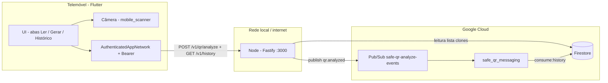
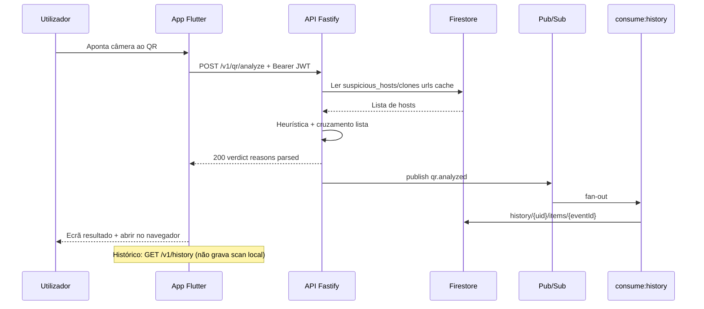

# Safe QR — Status para 2ª Sprint (P.I.) e próxima entrega

**Objetivo deste documento:** apoio à apresentação da **2ª Sprint (24/04)** e registo do que já está feito vs. o que o enunciado pede, com **stack**, **arquitetura** e visão para **mensageria (Pub/Sub)** na sprint seguinte.

**Referência do professor — entrega intermédia:**

- Back-end com endpoints básicos da API (**CRUD**)
- Front-end **parcialmente integrado** ao back-end
- **Banco de dados** implementado e **populado com dados de teste**
- **Ambiente em nuvem** (mesmo que parcial) + **documentação inicial**
- (Implícito) Documentação / evidências (prints, trechos de código)

---

## 1. Resumo executivo (o que dizer em 1 minuto)

O **Safe QR** já permite: ler um QR no **Flutter**, enviar o conteúdo para a **API Node (Fastify)** com **Bearer JWT** (Firebase Anonymous Auth), receber **veredito** (seguro / suspeito / inseguro) com **motivos**, e usar **lista de domínios suspeitos** no **Firestore**. Em modo **remoto**, o **histórico de scans** fica na nuvem (`history/{uid}/items`) via **Pub/Sub** (`consume:history`); em modo **local**, permanece em **SQLite** no telemóvel.

Para o checklist literal da 2ª sprint, **falta fechar** sobretudo: **deploy / doc de nuvem** mais explícitos e **evidências** (prints). **CRUD de histórico** e **mensageria Pub/Sub** já estão implementados.

---

## 2. Stack técnica (resumo para slides)

### Mobile — `safe_qr_app` (Flutter)

| Camada / uso | Tecnologia |
|--------------|------------|
| Framework | **Flutter** (Dart **SDK ^3.11**) |
| Estado global leve | **provider** |
| Injeção de dependências | **get_it** |
| HTTP / timeouts | **dio** |
| Config local | **flutter_dotenv** (`assets/.env`) |
| Câmera / leitura QR | **mobile_scanner** |
| Geração de QR | **qr_flutter** |
| Abrir links no navegador | **url_launcher** (`LaunchMode.externalApplication`) |
| Histórico no dispositivo | **sqflite** + **path** / **path_provider** |
| Preferências (tema, etc.) | **shared_preferences** |
| Identidade / JWT | **firebase_core**, **firebase_auth** (sessão anónima → Bearer) |
| Nuvem (cliente Firebase) | **cloud_firestore** (declarado; evolução futura no mobile) |
| Testes | **flutter_test**, **mocktail** |

### API — `safe_qr_back` (Node.js)

| Camada / uso | Tecnologia |
|--------------|------------|
| Runtime | **Node.js ≥ 20** |
| Linguagem | **TypeScript** (strict, ESM `type: module`) |
| Servidor HTTP | **Fastify 5** |
| CORS | **@fastify/cors** |
| Validação de entrada | **Zod** |
| Logs | **Pino** (+ **pino-pretty** em dev) |
| Variáveis de ambiente | **dotenv** (ficheiro `.env` na raiz do back) |
| Lista de clones (servidor) | **firebase-admin** (Firestore **read**) |
| Testes / CI local | **Vitest** |
| Qualidade | **ESLint**, **Prettier** |
| Execução dev | **tsx** (`npm run dev`) |

### Nuvem (estado atual)

| Serviço | Uso no projeto |
|---------|----------------|
| **Firebase / Google Cloud** | Projeto Firebase ligado ao app (FlutterFire) e à mesma conta para **Firestore** |
| **Cloud Firestore** | Documento **`suspicious_hosts` / `clones`**, campo **`urls`** (lista de URLs/hosts de alerta) lida pela API com **Admin SDK** |

---

## 3. Arquitetura lógica

### 3.1 Visão em blocos



### 3.2 Camadas no código (disciplina de projeto)

**Mobile (clean-ish por feature):** pastas `lib/features/*` com **presentation** (páginas, widgets, view models), **domain** (entidades, casos de uso), **data** (repositórios, DTOs, integração Dio / SQLite). **Core:** tema, rede, config, constantes. **App:** `main.dart`, router/shell, `dependency_injection.dart`.

**Back:** `routes` regista rotas; **controllers** validam limites e chamam **services**; **services** concentram a heurística de análise e a integração com **Firestore** (porta injetável); **schemas** (Zod); **views** serializam JSON de resposta/erro.

### 3.3 Fluxo principal — scan com análise remota



---

## 4. API REST atual

| Método | Caminho | Descrição |
|--------|---------|-----------|
| `GET` | `/v1/health` | Health check |
| `GET` | `/health` | Alias do health |
| `POST` | `/v1/qr/analyze` | Bearer obrigatório. Corpo: `rawContent` + `client`. Publica `qr.analyzed` se 200 |
| `GET` | `/v1/history` | Lista histórico do utilizador (Bearer) |
| `POST` | `/v1/history` | Cria item (ex.: QR gerado) |
| `DELETE` | `/v1/history/{id}` | Apaga item |
| `DELETE` | `/v1/history` | Limpa histórico |

**Erros comuns:** `400` (validação Zod), `413` (payload acima do limite configurável).

**Variáveis de ambiente relevantes (back):** `PORT`, `MAX_RAW_CONTENT_BYTES`, `GOOGLE_APPLICATION_CREDENTIALS` ou `FIREBASE_SERVICE_ACCOUNT_JSON`, `FIRESTORE_SUSPICIOUS_CACHE_MS`, `LOG_LEVEL`, `NODE_ENV`. Ver `safe_qr_back/.env.example`.

---

## 5. Estrutura do repositório (mono-pasta mobile)

```
safe-qr-mobile/
├── docs/                    ← documentação de sprint / arquitetura
├── safe_qr_app/             ← Flutter (app Android principal)
├── safe_qr_back/            ← API Node (Fastify) + testes
└── safe_qr_messaging/       ← consumidores Pub/Sub (histórico + auditoria)
```

O back **não** está num repositório separado neste layout; sobe com `cd safe_qr_back && npm run dev`.

---

## 6. Cruzamento com o checklist da 2ª Sprint

| Exigência | Estado atual | Notas / evidências sugeridas |
|-----------|--------------|------------------------------|
| **Back-end — CRUD básico** | **Feito (histórico)** | **`GET/POST/DELETE /v1/history`** + **`POST /v1/qr/analyze`**. Persistência Firestore `history/{uid}/items`. Auditoria: `scan_events/{id}` via `consume:audit`. |
| **Front-end integrado ao back** | **Feito** | `AuthenticatedAppNetwork` (Bearer automático), analyze remoto, histórico remoto (`GET /v1/history`), modo **local/remoto** via `.env`. |
| **Banco de dados + dados de teste** | **Feito (Firestore)** | **Firestore:** `suspicious_hosts/clones`, `history/{uid}/items` (populado por scans + `consume:history`), `scan_events` (audit). **SQLite:** histórico só em `ANALYZE_MODE=local`. |
| **Nuvem + documentação inicial** | **Parcial** | **Firebase** (projeto, Firestore, conta de serviço para o Node). Falta **documentar URL de API em nuvem** (se deploy existir) ou **plano de deploy** (Cloud Run / Cloud Functions / Render) + print da consola GCP/Firebase. |
| **Documentação / evidências** | **Em curso** | Este ficheiro + `SPRINT-1-ENTREGAVEIS.md` + READMEs do `safe_qr_app` e `safe_qr_back`. Acrescentar **prints** (Firebase, Postman, app) no relatório da equipa. |

---

## 7. O que já está feito (lista objetiva)

### Mobile (`safe_qr_app`)

- Splash, shell com **3 abas** (leitor, gerador, histórico).
- **Leitura de QR** com câmera; envio do payload para análise (**remota** ou heurística local).
- Exibição de **veredito**, motivos e fluxo de erro de rede.
- **Histórico remoto:** `RemoteHistoryRepository` + `GET /v1/history` (scans via Pub/Sub).
- **Histórico local:** SQLite quando `ANALYZE_MODE=local`.
- **`AuthenticatedAppNetwork`** — Bearer JWT em todos os pedidos ao back.
- **Firebase** Anonymous Auth no bootstrap (`UserIdentityService`).
- Configuração via **`assets/.env`** (`API_BASE_URL`, `ANALYZE_MODE`, etc.).

### Back-end (`safe_qr_back`)

- **Fastify** + **Zod** + logs estruturados (Pino).
- **`GET /v1/health`** (e alias `/health`).
- **`POST /v1/qr/analyze`**: Bearer obrigatório, validação, heurística, publish Pub/Sub.
- **CRUD `/v1/history`**: Firestore `history/{uid}/items`.
- **Firestore (Admin SDK):** leitura de **`suspicious_hosts/clones`** + escrita de histórico.
- **Pub/Sub produtor:** evento `qr.analyzed` com `historyItem` (ver `docs/13-pubsub-qr-analyzed.md`).
- **`.env`** com **`dotenv`**; exemplo em **`.env.example`**; chaves `safe-qr-app-*.json` no **`.gitignore`**.
- **Testes** (Vitest): health + contrato analyze + testes da lista (mock) + match de host.

---

## 8. O que falta para “cumprir ao pé da letra” o checklist

1. **Documentação de nuvem:** diagrama (app → API → Pub/Sub → Firestore), **variáveis de ambiente** em produção, URL pública se existir deploy (Cloud Run).
2. **Evidências para o professor:** prints (Postman com Bearer, Firebase `history/`, consumidor `consume:history`, app Android) + link do repositório.
3. **GCP manual:** subscription `safe-qr-analyze-events-sub-history` se ainda não criada.

---

## 9. Mensageria — **Google Cloud Pub/Sub** (implementado)

**Fluxo:** `POST /v1/qr/analyze` (+ Bearer) → resposta 200 → publish `qr.analyzed` → fan-out:

| Consumidor | Grava |
|------------|-------|
| `npm run consume:history` | `history/{idUser}/items/{id}` — histórico do app |
| `npm run consume:audit` | `scan_events/{eventId}` — auditoria |

**Docs:** `safe_qr_messaging/README.md`, `safe_qr_messaging/docs/02-FANOUT-HISTORICO-AUDIT.md`, `safe_qr_back/docs/13-pubsub-qr-analyzed.md`.

**Pendente GCP (manual):** criar subscription `safe-qr-analyze-events-sub-history` se ainda não existir.

---

## 10. Frase de encerramento sugerida na apresentação

> “Entregámos scan → API → veredito, histórico remoto via **Pub/Sub** (produtor no back, consumidor separado), CRUD de histórico com Firebase Auth, e lista dinâmica de clones no Firestore.”

---

**Fim do documento.** Atualizar após cada sprint (datas, links de deploy, nomes dos tópicos Pub/Sub).
