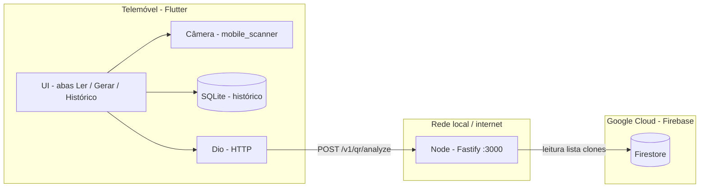
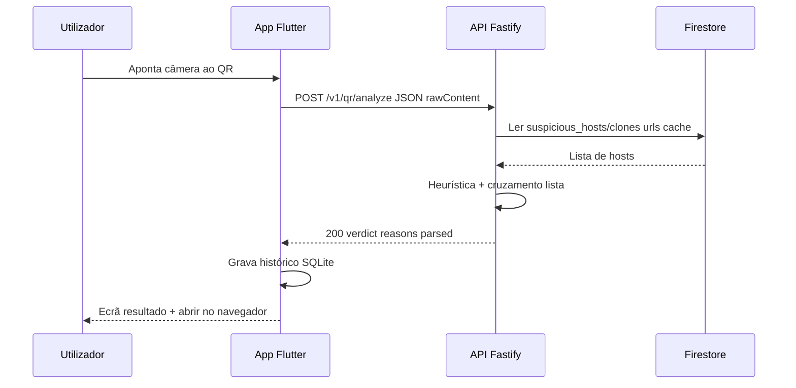

# Safe QR — Status para 2ª Sprint (P.I.) e próxima entrega

**Objetivo deste documento:** apoio à apresentação da **2ª Sprint (24/04)** e registo do que já está feito vs. o que o enunciado pede, com **stack**, **arquitetura** e visão para **mensageria (Pub/Sub)** na sprint seguinte.

**Referência do professor — entrega intermédia:**

- Back-end com endpoints básicos da API (**CRUD**)
- Front-end **parcialmente integrado** ao back-end
- **Banco de dados** implementado e **populado com dados de teste**
- **Ambiente em nuvem** (mesmo que parcial) + **documentação inicial**
- (Implícito) Documentação / evidências (prints, trechos de código)

---

## 1. Resumo executivo (o que dizer em 1 minuto)

O **Safe QR** já permite: ler um QR no **Flutter**, enviar o conteúdo para a **API Node (Fastify)**, receber **veredito** (seguro / suspeito / inseguro) com **motivos**, e usar **lista de domínios suspeitos** no **Firestore** (conta de serviço no back). O **histórico de scans** fica em **SQLite no telemóvel**. O projeto **Firebase** está criado e o **back** integra Firestore para a coleção `suspicious_hosts` / documento `clones`.

Para o checklist literal da 2ª sprint, **falta fechar** sobretudo: **CRUD no servidor**, **BD servidor com dados de teste** (além do Firestore de listas) e **deploy / doc de nuvem** mais explícitos. Na **próxima sprint** planeia-se **mensageria** com **Google Cloud Pub/Sub** após cada análise bem-sucedida.

---

## 2. Stack técnica (resumo para slides)

### Mobile — `safe_qr_app` (Flutter)

| Camada / uso | Tecnologia |
|--------------|------------|
| Framework | **Flutter** (Dart **SDK ^3.11**) |
| Estado global leve | **provider** |
| Injeção de dependências | **get_it** |
| HTTP / timeouts | **dio** |
| Config local | **flutter_dotenv** (`assets/.env`) |
| Câmera / leitura QR | **mobile_scanner** |
| Geração de QR | **qr_flutter** |
| Abrir links no navegador | **url_launcher** (`LaunchMode.externalApplication`) |
| Histórico no dispositivo | **sqflite** + **path** / **path_provider** |
| Preferências (tema, etc.) | **shared_preferences** |
| Nuvem (cliente Firebase) | **firebase_core**, **cloud_firestore** (inicialização; evolução futura) |
| Testes | **flutter_test**, **mocktail** |

### API — `safe_qr_back` (Node.js)

| Camada / uso | Tecnologia |
|--------------|------------|
| Runtime | **Node.js ≥ 20** |
| Linguagem | **TypeScript** (strict, ESM `type: module`) |
| Servidor HTTP | **Fastify 5** |
| CORS | **@fastify/cors** |
| Validação de entrada | **Zod** |
| Logs | **Pino** (+ **pino-pretty** em dev) |
| Variáveis de ambiente | **dotenv** (ficheiro `.env` na raiz do back) |
| Lista de clones (servidor) | **firebase-admin** (Firestore **read**) |
| Testes / CI local | **Vitest** |
| Qualidade | **ESLint**, **Prettier** |
| Execução dev | **tsx** (`npm run dev`) |

### Nuvem (estado atual)

| Serviço | Uso no projeto |
|---------|----------------|
| **Firebase / Google Cloud** | Projeto Firebase ligado ao app (FlutterFire) e à mesma conta para **Firestore** |
| **Cloud Firestore** | Documento **`suspicious_hosts` / `clones`**, campo **`urls`** (lista de URLs/hosts de alerta) lida pela API com **Admin SDK** |

---

## 3. Arquitetura lógica

### 3.1 Visão em blocos



### 3.2 Camadas no código (disciplina de projeto)

**Mobile (clean-ish por feature):** pastas `lib/features/*` com **presentation** (páginas, widgets, view models), **domain** (entidades, casos de uso), **data** (repositórios, DTOs, integração Dio / SQLite). **Core:** tema, rede, config, constantes. **App:** `main.dart`, router/shell, `dependency_injection.dart`.

**Back:** `routes` regista rotas; **controllers** validam limites e chamam **services**; **services** concentram a heurística de análise e a integração com **Firestore** (porta injetável); **schemas** (Zod); **views** serializam JSON de resposta/erro.

### 3.3 Fluxo principal — scan com análise remota



---

## 4. API REST atual (sem CRUD completo)

| Método | Caminho | Descrição |
|--------|---------|-----------|
| `GET` | `/v1/health` | Health check |
| `GET` | `/health` | Alias do health |
| `POST` | `/v1/qr/analyze` | Corpo: `rawContent` (+ `client` opcional). Resposta: `requestId`, `verdict`, `safeToOpen`, `reasons`, `parsed` |

**Erros comuns:** `400` (validação Zod), `413` (payload acima do limite configurável).

**Variáveis de ambiente relevantes (back):** `PORT`, `MAX_RAW_CONTENT_BYTES`, `GOOGLE_APPLICATION_CREDENTIALS` ou `FIREBASE_SERVICE_ACCOUNT_JSON`, `FIRESTORE_SUSPICIOUS_CACHE_MS`, `LOG_LEVEL`, `NODE_ENV`. Ver `safe_qr_back/.env.example`.

---

## 5. Estrutura do repositório (mono-pasta mobile)

```
safe-qr-mobile/
├── docs/                    ← documentação de sprint / arquitetura
├── safe_qr_app/             ← Flutter (app Android principal)
└── safe_qr_back/            ← API Node (Fastify) + testes
```

O back **não** está num repositório separado neste layout; sobe com `cd safe_qr_back && npm run dev`.

---

## 6. Cruzamento com o checklist da 2ª Sprint

| Exigência | Estado atual | Notas / evidências sugeridas |
|-----------|--------------|------------------------------|
| **Back-end — CRUD básico** | **Parcial** | Há **`GET /v1/health`**, **`POST /v1/qr/analyze`** e integração **Firestore** (leitura da lista). Não há ainda CRUD clássico REST (ex.: `GET/POST/PATCH/DELETE` de recurso em BD servidor). *Próximo passo:* expor recurso simples (ex.: `scan_events` ou `reports`) com **Create + List** em **Firestore** ou **PostgreSQL**. |
| **Front-end integrado ao back** | **Feito (MVP)** | App chama **`POST /v1/qr/analyze`**, trata erro de rede/timeout, modo **local/remoto** via `.env`. *Evidência:* print do Postman + print do resultado no app. |
| **Banco de dados + dados de teste** | **Parcial** | **Firestore:** documento `suspicious_hosts/clones` com array `urls` (dados de teste para clones). **SQLite no app:** histórico local. **Falta para o enunciado “BD + populado”:** dados de teste **no servidor** para um CRUD (ex.: coleção `demo_items` ou tabela SQL com seed). |
| **Nuvem + documentação inicial** | **Parcial** | **Firebase** (projeto, Firestore, conta de serviço para o Node). Falta **documentar URL de API em nuvem** (se deploy existir) ou **plano de deploy** (Cloud Run / Cloud Functions / Render) + print da consola GCP/Firebase. |
| **Documentação / evidências** | **Em curso** | Este ficheiro + `SPRINT-1-ENTREGAVEIS.md` + READMEs do `safe_qr_app` e `safe_qr_back`. Acrescentar **prints** (Firebase, Postman, app) no relatório da equipa. |

---

## 7. O que já está feito (lista objetiva)

### Mobile (`safe_qr_app`)

- Splash, shell com **3 abas** (leitor, gerador, histórico).
- **Leitura de QR** com câmera; envio do payload para análise (**remota** ou heurística local).
- Exibição de **veredito**, motivos e fluxo de erro de rede.
- **Histórico** persistido em **SQLite** no dispositivo.
- **Firebase** inicializado (`firebase_options` / `Firebase.initializeApp` no `main.dart`).
- Configuração via **`assets/.env`** (`API_BASE_URL`, `ANALYZE_MODE`, etc.).

### Back-end (`safe_qr_back`)

- **Fastify** + **Zod** + logs estruturados (Pino).
- **`GET /v1/health`** (e alias `/health`).
- **`POST /v1/qr/analyze`**: validação, limite de tamanho, heurística alinhada ao motor local.
- **Firestore (Admin SDK):** leitura de **`suspicious_hosts/clones`** (`urls`) para marcar **unsafe** quando o hostname coincide (com cache configurável).
- **`.env`** com **`dotenv`**; exemplo em **`.env.example`**; chaves `safe-qr-app-*.json` no **`.gitignore`**.
- **Testes** (Vitest): health + contrato analyze + testes da lista (mock) + match de host.

---

## 8. O que falta para “cumprir ao pé da letra” o checklist

1. **CRUD no back:** pelo menos **criar + listar** um recurso (ex.: registo de análise agregada ou itens de demo) persistido em **Firestore** ou **SQL**, com **seed** de dados de teste.
2. **Documentação de nuvem:** 1–2 páginas com **diagrama** (app → API → Firestore), **variáveis de ambiente** em produção, e **evidência** (print da consola ou URL pública se existir deploy).
3. **Evidências para o professor:** prints (Postman, Firebase, Android) + link ou anexo do repositório.

---

## 9. Próxima sprint — Mensageria com **Google Cloud Pub/Sub**

**Ideia (linguagem simples):** depois de cada **`POST /v1/qr/analyze` com sucesso**, o servidor **não precisa de fazer tudo na mesma hora**. Ele **responde já** ao telemóvel e, em paralelo, **manda uma mensagem pequena** para uma **fila na Google** (Pub/Sub). Outro programa (**subscritor**) pode: gravar estatísticas, mandar para BigQuery, ou só **registar no log** — o importante para a cadeira é mostrar **produtor → fila → consumidor**.

**Conteúdo sugerido da mensagem (privacidade):**

- `requestId`, `timestamp`, `verdict`, `safeToOpen`, **hash** do conteúdo (já existe digest no controller), **opcional** `host` parseado — evitar guardar URL completa se o grupo quiser minimizar dados.

**Passos técnicos (resumo):**

1. Na **Google Cloud Console** do mesmo projeto: ativar **Pub/Sub** → criar **tópico** (ex.: `safe-qr-analyze-events`).
2. Criar **subscrição** (ex.: `safe-qr-analyze-events-sub`) para pull ou push.
3. Dar à conta de serviço do back a permissão **`Pub/Sub Publisher`** (publicar).
4. No Node: cliente `@google-cloud/pubsub` → após resposta `200` do analyze, **`topic.publishMessage({ json: { ... } })`** (fire-and-forget com `catch` só a logar).
5. **Consumidor mínimo para demo:** script `npm run pubsub:listen` que faz pull e imprime, ou **Cloud Function** disparada pela subscrição (push).

**Risco / esforço:** médio (credenciais, billing GCP, primeiro deploy). Para apresentação, basta **tópico + publicação + um consumidor que mostre a mensagem no log**.

---

## 10. Frase de encerramento sugerida na apresentação

> “Entregámos o fluxo completo scan → API → veredito, com lista dinâmica no Firestore e app integrado. Para a rubrica de CRUD e BD servidor, vamos expor um recurso simples com dados de teste na próxima iteração. A mensageria com **Pub/Sub** fica como evolução clara: eventos de análise assíncronos sem bloquear o utilizador.”

---

**Fim do documento.** Atualizar após cada sprint (datas, links de deploy, nomes dos tópicos Pub/Sub).
