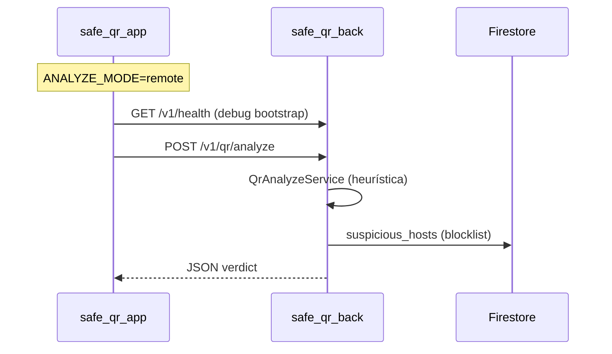

# 07 — API e integração com backend

## Visão geral

O app integra com **`safe_qr_back`** (Node.js/Fastify) quando `ANALYZE_MODE=remote`. Em modo `local`, nenhuma chamada HTTP de análise é feita.



## Configuração

Arquivo: `assets/.env`

| Chave | Descrição | Exemplo |
|-------|-----------|---------|
| `API_BASE_URL` | Base sem barra final | `http://10.0.2.2:3000` |
| `ANALYZE_MODE` | `local` ou `remote`/`api`/`server` | `remote` |
| `API_CONNECT_TIMEOUT_MS` | Timeout conexão Dio | `20000` |
| `API_RECEIVE_TIMEOUT_MS` | Timeout resposta Dio | `20000` |

### URLs por ambiente

| Ambiente | `API_BASE_URL` |
|----------|----------------|
| Android Emulator | `http://10.0.2.2:3000` |
| Celular físico (mesma Wi-Fi) | `http://<IP-LAN-PC>:3000` |
| iOS Simulator / desktop | `http://127.0.0.1:3000` |

**Erro comum:** usar `10.0.2.2` em celular físico — esse host só existe no emulador Android.

Constantes Dart: `lib/core/constants/app_endpoints.dart`, `app_env_keys.dart`

---

## Endpoints consumidos

| Método | Path | Uso no app |
|--------|------|------------|
| `GET` | `/v1/health` | Probe de debug no bootstrap (modo remote) |
| `POST` | `/v1/qr/analyze` | Análise de conteúdo QR |

Definição:

```dart
abstract final class AppEndpoints {
  static const String v1Root = '/v1';
  static const String health = '$v1Root/health';
  static const String qrAnalyze = '$v1Root/qr/analyze';
}
```

---

## `GET /v1/health`

### Request

```http
GET /v1/health HTTP/1.1
Host: <API_BASE_URL>
Accept: application/json
```

### Response `200`

```json
{
  "status": "ok",
  "service": "safe-qr-api",
  "version": "0.1.0"
}
```

**Implementação no app:** `dependency_injection.dart` → `_debugProbeBackendHealth()` (apenas `kDebugMode`).

---

## `POST /v1/qr/analyze`

### Request

Implementado em `RemoteQrAnalyzeRepository`:

```json
{
  "rawContent": "https://exemplo.com/pagamento",
  "client": {
    "appVersion": "1.0.0",
    "platform": "android"
  }
}
```

| Campo | Origem no app |
|-------|---------------|
| `rawContent` | Conteúdo escaneado (clip 2000 chars) |
| `client.appVersion` | `AppBuildInfo.versionLabel` |
| `client.platform` | `android`, `ios`, `web`, etc. |

### Response `200`

```json
{
  "requestId": "uuid",
  "verdict": "suspicious",
  "safeToOpen": false,
  "reasons": [
    "URL usa redirecionador conhecido (destino não visível diretamente)."
  ],
  "parsed": {
    "type": "url",
    "scheme": "https",
    "host": "exemplo.com"
  }
}
```

### Deserialização no app

1. `QrAnalyzeDto.fromJson()` — aceita camelCase e snake_case (`request_id`, `safe_to_open`)
2. `QrAnalysisMappers.toDomain()` → `QrAnalysisResult`

### Valores de `verdict`

| Valor | `safeToOpen` típico | UI |
|-------|---------------------|-----|
| `safe` | `true` | Botão abrir habilitado |
| `suspicious` | `false` | Abrir desabilitado ou com aviso |
| `unsafe` | `false` | Não abrir |
| `unknown` | `false` | Cautela |

---

## Erros da API

| Status | Corpo (exemplo) | Tratamento no app |
|--------|-----------------|-------------------|
| `400` | `VALIDATION_ERROR` | `AppHttpException` → mensagem de rede |
| `413` | `PAYLOAD_TOO_LARGE` | `AppHttpException` |
| `500` | `INTERNAL_ERROR` | `AppHttpException` |
| Timeout | — | `AppStrings.timeoutError` (status 408 mapeado) |
| Sem rede | — | `AppStrings.networkError` |

Camada: `DioAppNetwork` → exceções → `QrReaderViewModel`

---

## Modos de análise

| Modo | Variável `.env` | Repositório | Motor |
|------|-----------------|-------------|-------|
| **Local** | `ANALYZE_MODE=local` | `LocalHeuristicQrAnalyzeRepository` | `QrLocalHeuristicEngine` |
| **Remote** | `ANALYZE_MODE=remote` | `RemoteQrAnalyzeRepository` | API + Firestore (backend) |

### Diferenças local vs remote

| Aspecto | Local | Remote |
|---------|-------|--------|
| Dados enviados | Nenhum | `rawContent` + metadados cliente |
| Blocklist Firestore | Não | Sim (server-side) |
| Atualização de regras | Requer novo build | Deploy do backend |
| Loading mínimo | 3 segundos | Tempo real da API |
| Funciona offline | Sim | Não |

---

## Camada de rede (`AppNetwork`)

```dart
abstract class AppNetwork {
  Future<Map<String, dynamic>> get(String path, {Map<String, String>? headers});
  Future<Map<String, dynamic>> post(String path, {
    required Map<String, dynamic> body,
    Map<String, String>? headers,
  });
}
```

Implementação: `DioAppNetwork` com:

- `baseUrl` = `AppConfig.apiBaseUrl`
- Headers JSON padrão
- Timeouts de `AppConfig`

---

## Histórico — não vai para API

Após análise remota bem-sucedida, o app grava **localmente** em SQLite:

- Conteúdo do QR
- Veredito, `safeToOpen`, razões
- Timestamp

O backend **não persiste** histórico de scans do usuário na Sprint 1.

---

## Firebase — papéis distintos

| Componente | SDK | Papel atual |
|------------|-----|-------------|
| App Flutter | `firebase_core` | Inicialização apenas |
| App Flutter | `cloud_firestore` | Declarado, **não usado** |
| Backend | `firebase-admin` | Blocklist `suspicious_hosts/clones` |

---

## Testar integração

1. Subir backend: `cd safe_qr_back && npm run dev`
2. Descobrir IP: `ipconfig` (Windows)
3. Configurar `assets/.env`: `API_BASE_URL=http://<IP>:3000`, `ANALYZE_MODE=remote`
4. Rebuild Flutter: `flutter run`
5. Escanear QR e verificar logs (`SafeQR.Net`, log do backend)

Documentação backend: [`../../safe_qr_back/docs/10-integracao-mobile.md`](../../safe_qr_back/docs/10-integracao-mobile.md)

---

## Checklist ao alterar contrato

Atualizar simultaneamente:

- [ ] Schema Zod no backend
- [ ] `QrAnalyzeDto` / `QrAnalysisMappers` no Flutter
- [ ] Testes backend (`test/qr-analyze.test.ts`)
- [ ] `test/features/qr_scanner/qr_analyze_dto_test.dart`
- [ ] Esta documentação e `05-api-endpoints.md` do backend
