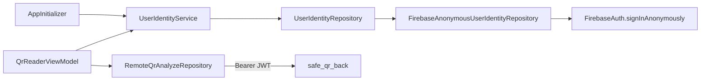

# 17 — Identidade: Firebase Anonymous Auth

## Objetivo

Fornecer identidade estável (Firebase UID) em cada `POST /v1/qr/analyze` remoto via **Bearer JWT**, para correlacionar eventos Pub/Sub → histórico Firestore (`history/{uid}/items`).

**Sem** ecrã de login, e-mail ou palavra-passe — sessão anónima automática.

---

## Arquitetura no app



### Camadas (`lib/core/identity/`)

| Ficheiro | Papel |
|----------|-------|
| `user_identity_repository.dart` | Contrato (domínio) |
| `firebase_anonymous_user_identity_repository.dart` | Implementação Firebase |
| `user_identity_service.dart` | Caso de uso (`getOrCreateIdUser`) |
| `user_identity_exception.dart` | Erros de identidade |

### Bootstrap

1. `Firebase.initializeApp()` em `AppInitializer`
2. `configureDependencies()` regista repositório + serviço
3. `_ensureAnonymousIdentity()` chama `getOrCreateIdUser()` cedo (log `SafeQR.Identity`)

### Consumo no scan

`QrReaderViewModel.analyzeDecoded()` → `UserIdentityService` → `RemoteQrAnalyzeRepository`:

**Header (obrigatório para o back validar identidade):**

```http
Authorization: Bearer <Firebase ID Token>
```

Obtido via `await FirebaseAuth.instance.currentUser!.getIdToken()` encapsulado em `UserIdentityService.getIdToken()`.

**Body (complementar — mesmo UID):**

```json
"client": {
  "appVersion": "1.0.0",
  "platform": "android",
  "idUser": "<Firebase UID>"
}
```

O back (`FirebaseUserIdentityService`) prioriza o Bearer e faz `verifyIdToken` → `decoded.uid`.

---

## Configuração manual (obrigatória)

### 1. Firebase Console

1. Abra [Firebase Console](https://console.firebase.google.com/) → projeto do app (`safe-qr-app` ou o vosso)
2. **Build** → **Authentication** → **Sign-in method**
3. Ative **Anonymous** (Anónimo) → **Save**

Sem este passo o app regista `operation-not-allowed` / `admin-restricted-operation` nos logs.

### 2. Dependências Flutter

```bash
cd safe_qr_app
flutter pub get
```

Pacote adicionado: `firebase_auth` (junto com `firebase_core` já existente).

### 3. Ficheiros nativos (já devem existir)

| Plataforma | Ficheiro |
|------------|----------|
| Android | `android/app/google-services.json` |
| iOS | `ios/Runner/GoogleService-Info.plist` |
| Dart | `lib/firebase_options.dart` |

Se faltar algum, execute na pasta do app:

```bash
flutterfire configure
```

### 4. Rebuild

```bash
flutter run
```

Filtre logs: `adb logcat | findstr SafeQR.Identity`

---

## Comportamento e limites

| Cenário | Comportamento |
|---------|---------------|
| Primeiro arranque com rede | `signInAnonymously()` → UID guardado pelo SDK |
| Arranques seguintes | Reutiliza `FirebaseAuth.instance.currentUser` |
| Sem rede no 1º sign-in | `UserIdentityException`; scan remoto mostra mensagem amigável |
| Desinstalar / limpar dados | Novo UID anónimo |
| Modo `ANALYZE_MODE=local` | `idUser` não é enviado ao servidor (identidade ainda é criada no bootstrap) |

### Formato do `idUser`

- **Antes:** `usr_<uuid>` em `SharedPreferences`
- **Agora:** Firebase UID (ex.: `K7xY2zQ1aBcDeFgHiJkLmNoPqRs`)

Backend aceita `z.string().max(128)` — compatível.

---

## Privacidade (RNF-02)

- Não é identidade real (sem e-mail, nome ou telefone)
- UID anónimo para correlação técnica de eventos
- Documentar na política: pseudónimo gerido pelo Firebase Auth
- Evolução futura: `linkWithCredential()` para conta real, mantendo o mesmo UID

Ver também: [MOBILE-DADOS-EPRIVACIDADE.md](./MOBILE-DADOS-EPRIVACIDADE.md)

---

## Testes

```bash
flutter test test/core/identity/user_identity_service_test.dart
```

Testes de integração com Firebase real exigem dispositivo/emulador e Auth ativo no Console.

---

## Evolução (não implementado)

| Feature | Requisitos extra |
|---------|------------------|
| Push (FCM) | `firebase_messaging` + guardar token por UID |
| Conta real | `linkWithCredential()` após Anonymous |

---

## Troubleshooting

| Log / erro | Causa | Solução |
|------------|-------|---------|
| `operation-not-allowed` | Anonymous desativado | Ativar no Console (§1) |
| `network-request-failed` | Sem internet | Wi‑Fi/dados móveis |
| Bootstrap identity falhou | Auth ou rede | Ver `SafeQR.Identity` no logcat |
| `idUser` null no consumidor | Analyze sem Bearer ou mensagem antiga na fila | App com token; reiniciar `consume:history` |
