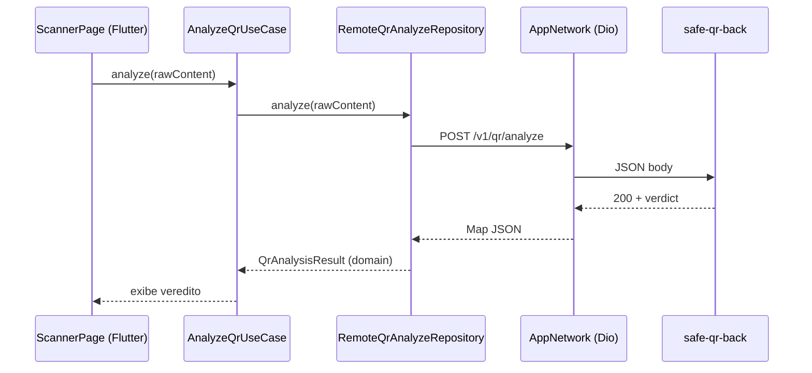

# 10 — Integração com o app mobile (Flutter)

O backend foi projetado como parceiro do app **`safe_qr_app`**. O contrato HTTP é estável e compartilhado entre os dois projetos.

## Visão geral da integração



## Configuração no app

Arquivo: `safe_qr_app/assets/.env`

| Chave | Descrição | Exemplo |
|-------|-----------|---------|
| `API_BASE_URL` | URL base da API (sem trailing slash) | `http://192.168.1.10:3000` |
| `ANALYZE_MODE` | `local` ou `remote` | `remote` |

Chaves definidas em `lib/core/constants/app_env_keys.dart`.

## Endpoints consumidos

Definidos em `lib/core/constants/app_endpoints.dart`:

```dart
abstract final class AppEndpoints {
  static const String v1Root = '/v1';
  static const String health = '$v1Root/health';       // GET
  static const String qrAnalyze = '$v1Root/qr/analyze'; // POST
}
```

## Request enviado pelo app

Implementação: `RemoteQrAnalyzeRepository`

```dart
await _net.post(
  AppEndpoints.qrAnalyze,
  body: {
    'rawContent': rawContent,
    'client': {
      'appVersion': appVersion ?? AppBuildInfo.versionLabel,
      'platform': platform ?? 'android',
    },
  },
);
```

## Response mapeada no app

O JSON da API é deserializado via `QrAnalyzeDto.fromJson()` e convertido para entidade de domínio `QrAnalysisResult` em `QrAnalysisMappers.toDomain()`.

### Campos esperados pelo app

| Campo API | Uso no app |
|-----------|------------|
| `verdict` | Enum `QrSecurityVerdict` |
| `safeToOpen` | Habilita/desabilita botão "Abrir" |
| `reasons` | Lista exibida na tela de resultado |
| `parsed.type` | Ícone / categorização |
| `parsed.scheme` | Detalhe técnico |
| `parsed.host` | Exibição do domínio |
| `requestId` | Correlação (futuro) |

## Modos de análise

| Modo | Quando | Motor |
|------|--------|-------|
| `local` | `ANALYZE_MODE=local` | `LocalQrAnalyzeRepository` → heurística no device |
| `remote` | `ANALYZE_MODE=remote` | `RemoteQrAnalyzeRepository` → esta API |

A heurística remota **espelha** a local (`QrLocalHeuristicEngine` ↔ `QrAnalyzeService`).

### Vantagem do modo remote

- Lista Firestore de clones aplicada server-side
- Atualização de regras sem redeploy do app
- Logs centralizados no servidor

## Health check no bootstrap

`dependency_injection.dart` verifica conectividade:

```dart
await sl<AppNetwork>().get(AppEndpoints.health);
// Log: "Bootstrap: GET {apiBaseUrl}/v1/health OK"
```

Se falhar, o app ainda inicia mas loga aviso — útil para debug de rede.

## Tratamento de erros no app

| Status API | Comportamento esperado no app |
|------------|-------------------------------|
| `200` | Exibe resultado |
| `400` | Mensagem de payload inválido |
| `413` | QR muito grande |
| `500` | Erro genérico |
| Timeout / rede | Mensagem amigável (RF-M10) |

Implementado via camada `AppNetwork` (Dio) com timeouts configuráveis.

## Histórico

O histórico de scans fica em **SQLite no dispositivo** (`sqflite`), não no backend. Após análise remota bem-sucedida, o app grava localmente:

- Conteúdo do QR
- Veredito
- Timestamp

## Firebase — papéis distintos

| Componente | SDK | Papel |
|------------|-----|-------|
| App Flutter | `firebase_core`, `cloud_firestore` | Inicialização; evolução futura |
| Backend | `firebase-admin` | Leitura da blocklist `suspicious_hosts/clones` |

Ambos usam o **mesmo projeto Firebase**, mas com responsabilidades diferentes.

## Testar integração manualmente

1. Subir backend: `cd safe_qr_back && npm run dev`
2. Descobrir IP da máquina: `ipconfig` (Windows) ou `ip a`
3. Configurar app: `API_BASE_URL=http://<IP>:3000`, `ANALYZE_MODE=remote`
4. Rebuild do app Flutter
5. Escanear QR e verificar log do backend (`event: qr_analyze`)

## Compatibilidade de versões

| Backend | App | Notas |
|---------|-----|-------|
| 0.1.0 | Sprint 1+ | Contrato estável |
| Futuro `/v2` | — | Manter `/v1` enquanto app antigo em uso |

## Checklist para mudanças no contrato

Ao alterar a API, atualizar **simultaneamente**:

- [ ] `src/schemas/qr-analyze.schema.ts` (backend)
- [ ] `src/views/qr-analyze-response.view.ts` (backend)
- [ ] `QrAnalyzeDto` / mappers (Flutter)
- [ ] `test/qr-analyze.test.ts` (backend)
- [ ] Testes Flutter (se existirem)
- [ ] Esta documentação (`05-api-endpoints.md`)
