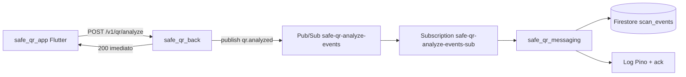

# safe_qr_messaging

Consumidor **Google Cloud Pub/Sub** do projeto **Safe QR**. Recebe eventos de análise de QR Code publicados pela API (`safe_qr_back`), valida o envelope JSON, **persiste em Firestore** (`scan_events`), registra log estruturado e confirma entrega (**ack**).

---

## Papel no ecossistema



| Componente | Responsabilidade |
|------------|------------------|
| `safe_qr_app` | Envia `client.idUser` + conteúdo do QR |
| `safe_qr_back` | Analisa, responde HTTP 200, **publica** evento (fire-and-forget) |
| **Este repo** | **Consome**, valida, **grava Firestore**, loga, **ack** / **nack** |
| Google Cloud Pub/Sub | Fila at-least-once entre produtor e consumidor |

---

## Infraestrutura GCP (projeto `safe-qr-app`)

| Recurso | Nome |
|---------|------|
| Tópico | `safe-qr-analyze-events` |
| Subscription (Pull) | `safe-qr-analyze-events-sub` |
| SA consumidor | `safe-qr-pubsub-consumer@safe-qr-app.iam.gserviceaccount.com` |
| Roles | `roles/pubsub.subscriber` + `roles/datastore.user` (Firestore write) |
| Coleção Firestore | `scan_events` (doc ID = `eventId`) |

Setup manual detalhado: **[docs/01-PUBSUB-IMPLEMENTACAO.md](./docs/01-PUBSUB-IMPLEMENTACAO.md)**

---

## Pré-requisitos

- **Node.js ≥ 20**
- Conta de serviço **consumer** com chave JSON (não commitar)
- SA com **`pubsub.subscriber`** e **`Cloud Datastore User`** (escrita Firestore)
- Tópico e subscription criados no GCP
- API `safe_qr_back` com `PUBSUB_ENABLED=true` publicando no mesmo tópico

---

## Setup local

```bash
cd safe_qr_messaging
cp .env.example .env
npm install
```

Coloque a chave da SA consumidor em:

```
credentials/safe-qr-pubsub-consumer.json
```

Exemplo `.env`:

```env
GCP_PROJECT_ID=safe-qr-app
GOOGLE_APPLICATION_CREDENTIALS=./credentials/safe-qr-pubsub-consumer.json
PUBSUB_SUBSCRIPTION=safe-qr-analyze-events-sub
FIRESTORE_ENABLED=true
FIRESTORE_COLLECTION=scan_events
FIREBASE_GOOGLE_APPLICATION_CREDENTIALS=./credentials/safe-qr-pubsub-consumer.json
CONSUMER_ENABLED=true
LOG_LEVEL=info
```

### IAM — adicionar Firestore na SA consumer

No [Console IAM](https://console.cloud.google.com/iam-admin/iam) → conta `safe-qr-pubsub-consumer@...` → **Conceder acesso** → role **`Cloud Datastore User`**.

Ou via gcloud:

```bash
gcloud projects add-iam-policy-binding safe-qr-app \
  --member="serviceAccount:safe-qr-pubsub-consumer@safe-qr-app.iam.gserviceaccount.com" \
  --role="roles/datastore.user"
```

Reinicie o consumidor após alterar a role (pode levar ~1 min para propagar).

---

## Comandos

| Comando | Descrição |
|---------|-----------|
| `npm run consume:events` | Inicia consumidor pull (processo contínuo) |
| `npm test` | Testes unitários (schema Zod) |

---

## Teste ponta a ponta

**Terminal 1 — consumidor:**

```bash
npm run consume:events
```

**Terminal 2 — API:**

```bash
cd ../safe_qr_back
npm run dev
```

**Terminal 3 — simular analyze:**

```bash
curl -s -X POST http://localhost:3000/v1/qr/analyze \
  -H "Content-Type: application/json" \
  -d '{
    "rawContent": "https://example.com",
    "client": {
      "platform": "android",
      "appVersion": "1.0.0",
      "idUser": "usr_test_001"
    }
  }'
```

**Esperado no consumidor:** log `qr_analyzed_consumed` com `firestore.result: "created"` (ou `"exists"` se duplicado).

**Esperado no Firestore:** documento em `scan_events/{eventId}` com `verdict`, `idUser`, `host`, `occurredAt`, `consumedAt`.

---

## Contrato do evento (`qr.analyzed`)

Publicado pelo `safe_qr_back` após HTTP 200. Exemplo:

```json
{
  "schemaVersion": "1",
  "eventId": "uuid-v4",
  "eventType": "qr.analyzed",
  "occurredAt": "2026-06-08T20:15:30.123Z",
  "source": "safe-qr-api",
  "correlationId": "request-id-http",
  "data": {
    "idUser": "usr_...",
    "contentDigest": "a1b2c3d4e5f67890",
    "rawByteLength": 42,
    "verdict": "safe",
    "safeToOpen": true,
    "reasonCodes": ["HTTPS_OK"],
    "reasonsCount": 1,
    "parsed": { "type": "url", "scheme": "https", "host": "example.com" },
    "client": { "platform": "android", "appVersion": "1.0.0" },
    "analysisDurationMs": 85
  }
}
```

**Privacidade:** sem `rawContent` na mensagem — apenas hash (`contentDigest`) e metadados.

Validação: `src/schemas/qr-analyzed.schema.ts` (Zod).

---

## Estrutura do código

```
safe_qr_messaging/
├── credentials/                 # .gitignore — JSON da SA
├── docs/
│   └── 01-PUBSUB-IMPLEMENTACAO.md
├── scripts/
│   └── consume-analyze-events.ts   # entrypoint CLI
├── src/
│   ├── config/env.ts
│   ├── lib/logger.ts
│   ├── schemas/qr-analyzed.schema.ts
│   ├── mappers/scan-event-document.mapper.ts
│   ├── repositories/
│   │   ├── scan-event-repository.port.ts
│   │   ├── firestore-scan-event.repository.ts
│   │   ├── null-scan-event.repository.ts
│   │   └── create-scan-event-repository.ts
│   ├── services/
│   │   ├── pubsub-subscriber.service.ts
│   │   └── processed-event-cache.ts
│   └── handlers/qr-analyzed.handler.ts
└── test/qr-analyzed.schema.test.ts
```

### Fluxo interno

1. `PubSubSubscriberService` — pull da subscription
2. Parse JSON + validação Zod
3. Dedupe `eventId` em memória (at-least-once)
4. `QrAnalyzedHandler` — grava Firestore + log estruturado (Pino)
5. `ack` em sucesso; `nack` em erro (retry — ex.: Firestore indisponível)

### Documento Firestore (`scan_events/{eventId}`)

| Campo | Descrição |
|-------|-----------|
| `eventId` | UUID (também ID do documento — idempotente) |
| `idUser` | Usuário anônimo do app |
| `verdict` | safe / suspicious / unsafe / unknown |
| `contentDigest` | Hash do conteúdo (sem URL completa) |
| `host` | Em `parsed.host` |
| `occurredAt` | Quando a API analisou |
| `consumedAt` | Quando o consumidor gravou |

---

## Variáveis de ambiente

| Variável | Obrigatória | Default | Descrição |
|----------|-------------|---------|-----------|
| `GCP_PROJECT_ID` | Sim | — | ID do projeto GCP |
| `GOOGLE_APPLICATION_CREDENTIALS` | Sim (local) | — | Caminho para JSON da SA consumer |
| `PUBSUB_SUBSCRIPTION` | Não | `safe-qr-analyze-events-sub` | Subscription pull |
| `CONSUMER_ENABLED` | Não | `true` | Liga/desliga consumidor |
| `CONSUMER_MAX_MESSAGES` | Não | `10` | Flow control |
| `CONSUMER_ACK_DEADLINE_SEC` | Não | `60` | Referência documental |
| `FIRESTORE_ENABLED` | Não | `true` | Grava eventos no Firestore |
| `FIRESTORE_COLLECTION` | Não | `scan_events` | Coleção destino |
| `FIREBASE_GOOGLE_APPLICATION_CREDENTIALS` | Não | fallback `GOOGLE_APPLICATION_CREDENTIALS` | JSON da SA com acesso Firestore |
| `FIREBASE_SERVICE_ACCOUNT_JSON` | Não | — | JSON inline (CI/PaaS) |
| `LOG_LEVEL` | Não | `info` | Nível Pino |

---

## Segurança

- **Nunca** commitar `credentials/*.json` ou `.env`
- SA consumer: `pubsub.subscriber` + `datastore.user` (least privilege para o que o módulo faz)
- Chaves rotacionar se expostas acidentalmente

---

## Evolução planejada

| Fase | Item |
|------|------|
| Back | `GET /v1/scan-events` (listar do Firestore) |
| Tópico 2 | `safe-qr-blocklist-updates` (consumidor separado) |
| Opcional | Dead-letter topic + subscription |
| Opcional | Cloud Run job para consumidor 24/7 |

---

## Repositórios relacionados

```
safe-qr-mobile/
├── safe_qr_app/          # Flutter — idUser + scan
├── safe_qr_back/         # API — produtor Pub/Sub
└── safe_qr_messaging/    # Este repo — consumidor
```

---

## Documentação

- **[docs/01-PUBSUB-IMPLEMENTACAO.md](./docs/01-PUBSUB-IMPLEMENTACAO.md)** — especificação completa (GCP, IAM, contratos, integração)
- `safe_qr_back/docs/` — API e endpoints
- `safe_qr_app/docs/07-api-integracao.md` — integração mobile

---

**Versão:** 0.2.0 · **Stack:** Node 20, TypeScript, `@google-cloud/pubsub`, `firebase-admin`, Zod, Pino
